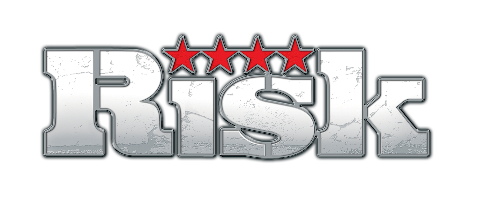

# RISKChain

Authors
------
### Luke Burford 
### Sean Thunquest 
### David Wells 

Project Description
-----
Risk is a game of world domination. Through the ups and downs of the game power is gained and lost at the peril of other players. Anyone who has played this classic board game know that it is cutthroat with triumph, failure, and sometimes emotional outbursts of rage, often resulting in boardflipping. This is where a blockchain can improve the board game world. Creating a Dapp (decentralized application) on a blockchain was a natural solution to these problems. Blockchains are immutable, so there is no flipping of boards, or cheating by fudging rolls or sneaking any extra troops in Argentina. Using react, web3 and Solidity this has become a reality with Risk-Chain.
